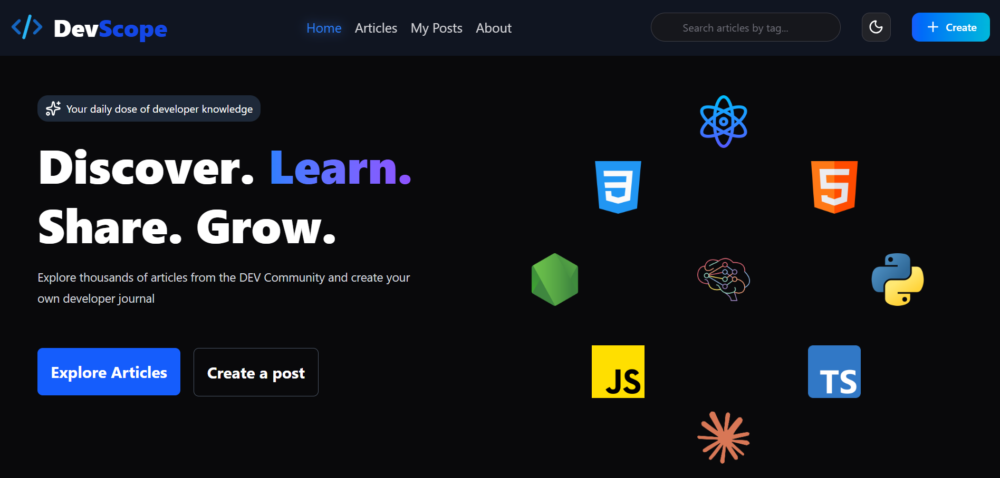
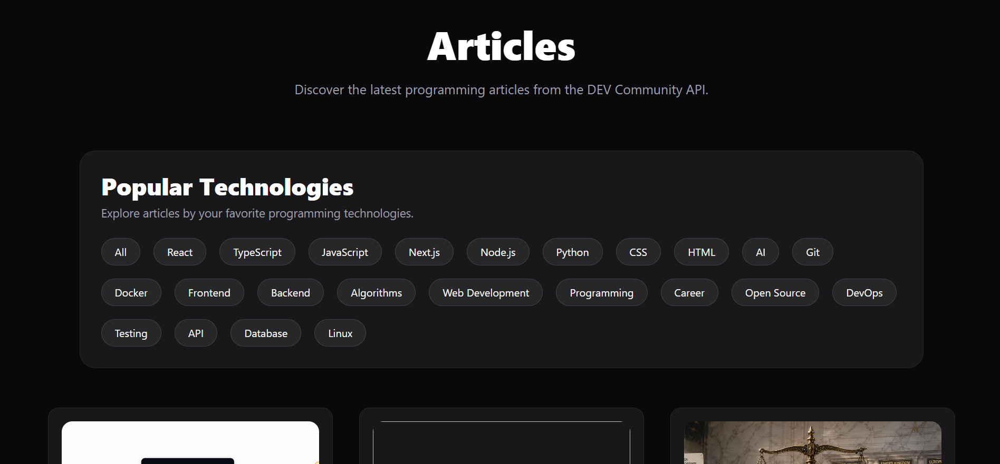
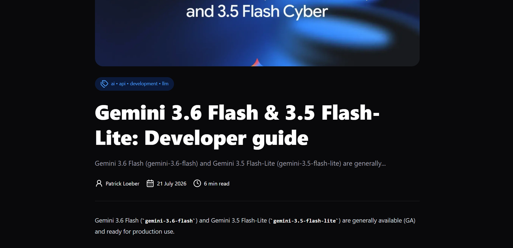
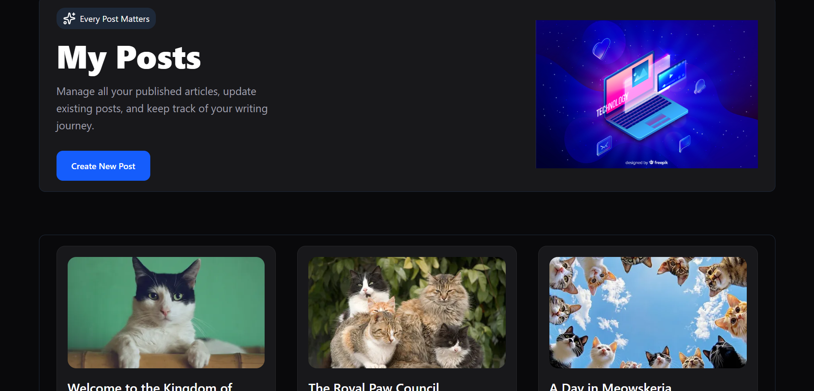
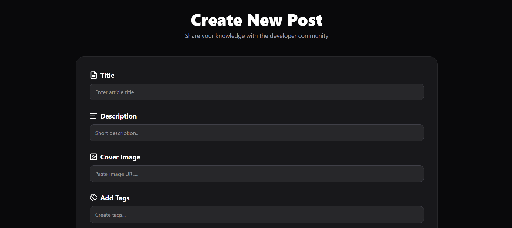

# DevScope

> Learn from the developer community. Share your own journey.



🌐 **Live Demo:** https://devscope-bay.vercel.app/  
📂 **Source Code:** https://github.com/varunn29/Blog-App

## About

DevScope is a modern blogging platform built with React, TypeScript, Tailwind CSS, and Vite.

It combines articles fetched from the DEV Community API with a personal blogging experience. Users can browse developer articles, read full posts, and create their own blogs that are stored locally in the browser. Local posts can be edited or deleted at any time, making DevScope a place to both learn from the community and document your own development journey.

## Features

- Browse articles fetched from the DEV Community API
- Read complete articles
- Create your own blog posts
- View all your posts in one place
- Edit existing posts
- Delete posts
- Persistent local storage for user-created posts
- Browse articles with pagination
- Responsive design for desktop and mobile devices

## Installation

Follow these steps to run DevScope locally:

```bash
git clone https://github.com/varunn29/Blog-App.git
cd Blog-App
npm install
npm run dev
```

## Tech Stack

<p>

</p>

| Technology | Purpose |
|------------|---------|
| React | UI development |
| TypeScript | Type safety |
| Tailwind CSS | Styling |
| Vite | Build tool |
| DEV Community API | Fetching developer articles |
| Local Storage | Persisting user-created blog posts |

## What I Learned

Building DevScope helped me strengthen several core frontend engineering concepts:

- Designing reusable React components to reduce duplication and improve maintainability.
- Managing shared application state using the React Context API.
- Using TypeScript to catch errors early and improve code reliability.
- Organizing a growing React application into reusable components, pages, and context providers.
- Working with external APIs and handling asynchronous data fetching.
- Building responsive layouts with Tailwind CSS for desktop and mobile devices.

## Screenshots

### Articles



### Article Details



### My Posts



### Create Post



## Future Improvements

- User authentication and personal accounts.
- Build a full-stack version with a backend and database instead of Local Storage.
- Bookmark and save articles for later reading.
- Like and comment system for community interaction.
- User profiles with published posts.
- Rich text/Markdown editor for writing articles.